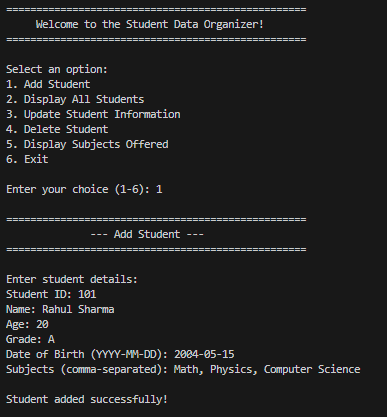
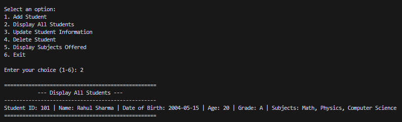
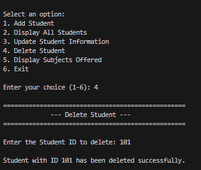

# Student Data Organizer

A command-line tool built with Python that helps manage student information. It tracks student records handles enrollments and supports full create, read, update and delete operations. The application includes checks to maintain data accuracy and handles errors during runtime.

---

## Features

* **Add Student:** Register students using IDs, record their demographics, and include a custom list of subjects.

* **Display All Records:** Show a table with all active student profiles.

* **Update Records:** Modify fields such as Name, Age, Grade, DOB and Subjects for a student, by ID.

* **Delete Record:** Remove a student record instantly from both dictionary and list data structures.

* **Subjects Directory:** Show a set that lists all distinct subjects offered in current enrollments.

* **Fault-Tolerant CLI:** Validate inputs to guard against data types and missing lookup keys.


---

## Preview





---

## Output

```
==================================================
     Welcome to the Student Data Organizer!
==================================================

Select an option:
1. Add Student
2. Display All Students
3. Update Student Information
4. Delete Student
5. Display Subjects Offered
6. Exit

Enter your choice (1-6): 1

==================================================
              --- Add Student ---
==================================================

Enter student details:
Student ID: 101
Name: Rahul Sharma
Age: 20
Grade: A
Date of Birth (YYYY-MM-DD): 2004-05-15
Subjects (comma-separated): Math, Physics, Computer Science

Student added successfully!

==================================================

Select an option:
1. Add Student
2. Display All Students
3. Update Student Information
4. Delete Student
5. Display Subjects Offered
6. Exit

Enter your choice (1-6): 2

==================================================
          --- Display All Students ---
--------------------------------------------------
Student ID: 101 | Name: Rahul Sharma | Date of Birth: 2004-05-15 | Age: 20 | Grade: A | Subjects: Math, Physics, Computer Science
==================================================

Select an option:
1. Add Student
2. Display All Students
3. Update Student Information
4. Delete Student
5. Display Subjects Offered
6. Exit

Enter your choice (1-6): 3

==================================================
        --- Update Student Information ---
==================================================

Enter the Student ID to update: 101

Student Found
Student ID: 101
Student Name: Rahul Sharma

What would you like to update?
1. Name
2. Age
3. Grade
4. Date of Birth
5. Subjects
6. Cancel

Enter your choice (1-6): 3
Enter new grade: A+

Student's grade updated successfully!

Select an option:
1. Add Student
2. Display All Students
3. Update Student Information
4. Delete Student
5. Display Subjects Offered
6. Exit

Enter your choice (1-6): 6

==================================================
   Exiting the Student Data Organizer. Goodbye!
==================================================
```

